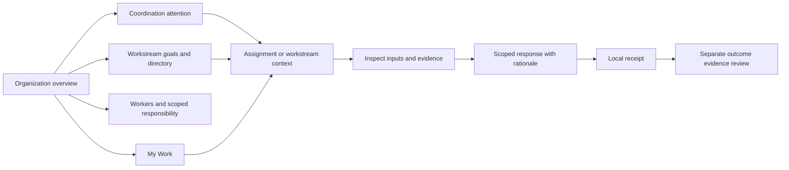

# Forge workspace — design specification

## Product promise

Understand the organization, find what needs coordination, and enter personal work with clear responsibility and evidence.

The primary persona is a human contributor or decision maker working alongside AI and deterministic workers. The prototype's Alex persona holds reviewer and release-authority roles on different assignments to demonstrate both experiences.

## Navigation and screen inventory

| Screen | Primary question | Main action |
| --- | --- | --- |
| My Work | What requires my attention? | Open an assignment |
| Assignment / Overview | What am I responsible for, with which inputs and permissions? | Submit a scoped response |
| Assignment / Evidence | What supports this work? | Inspect an artifact |
| Assignment / Activity | What was recorded and why? | Read the response history |
| Organization | What needs coordination across shared goals? | Inspect attention or open a workstream/worker |
| Workstreams directory | Which goals need responsibility or outcome evidence? | Filter and open a workstream |
| Workers directory | Who holds which scoped responsibilities? | Filter workers and inspect bindings/assignment links |
| Workstream detail | How should responsibilities exchange work? | Inspect flow, assignment, handoff or outcome |
| Organization attention/activity | What needs follow-up, and which records exist? | Inspect a signal or record |
| Demos | How does collaboration work? | Start the guided walkthrough or independent scenarios |
| Evidence | Which artifacts exist in this organization? | Inspect represented records; read-only samples show their own empty fixture and requirements |

## First-use path

The production path must replace the demo step with a command to the Go application API, server-side identity and permission checks, governed admission, and an authoritative receipt. A pending command must not appear as an admitted decision. Approval must remain distinct from execution and confirmed external effects.

## Interaction rules

- Responsibility cards filter the inbox; selecting a card again clears the filter.
- Search combines with the selected category and To do / Completed state.
- Review assignments expose assessment, not approval actions.
- Release-authority assignments expose approval and refusal. Both require rationale.
- Cancel and Escape dismiss a dialog without changing the assignment.
- A recorded local response removes the assignment from To do and preserves it under Completed for this session.
- Recording a release decision updates the sample evidence chain's Authority step. Effect remains unestablished.
- Refresh resets all simulated responses. This is stated in the response dialog.

## Visual system

| Element | Direction |
| --- | --- |
| Canvas | Warm, pale neutral, `#f6f7f3` |
| Navigation | Deep green, `#1c302e` |
| Primary action | Forest green, `#355440` |
| Authority | Pale amber background with dark amber label |
| Assessment | Pale slate-blue background with dark blue label |
| Reconciliation | Pale lavender background with dark purple label |
| Surface | White panels, fine borders, small corner radii |
| Type | Local system sans-serif; restrained headings and compact supporting text |
| Icons | Lucide line icons; icons supplement text labels |

Organization Overview prioritizes the attention summary immediately after shared purpose. Concise workstream cards expose goals/outcomes and link to detail. Worker summaries expose identity/type and scoped binding counts; full roles/scopes and assignment lists live in their directories/details. Native disclosures retain secondary other-work/gap context and the workspace glossary. Section shortcuts remain keyboard accessible.

The desktop composition reserves the left edge for navigation and the main area for organization coordination. My Work uses a narrow right column for personal context. Assignment detail uses the same right column for permission scope and response actions. On smaller screens it becomes a single-column reading order.

## Deliberate limits and follow-up design

This exploration covers an organization-first sample workspace and the human work loop. It includes bounded response-delivery/readiness previews, local proposals and allocation-plan decisions. Accepted plans await allocation: they create no assignment, binding or permission. Organization activity lists proposal/plan-decision records alongside responses and evidence. Each dated section is independently ordered; local coordination records disappear when their proposal is removed and are not a permanent audit log.

Production design still needs validated identity and effective authority, durable admission/receipts, concurrent changes, real runtime/worker data and verified external effects. A shared frontend scenario contract now feeds the overview and directories for the main software, larger software and knowledge samples. The larger sample has scenario-qualified read-only detail/assignment inspection; specialized interactive assignment inputs remain main-only. The original standalone larger demo also remains available. Role administration, broader audit search and organization/persona switching need explicit data and interaction contracts.

Do not infer completed deployment, verified provenance or server authorization from this prototype. Responses, proposals and plan decisions are mutable session records; refresh clears them. Main organization relationships and evidence fixtures are authored examples. The current prototype demonstrates software and knowledge operations through shared organization screens. Knowledge persona inboxes remain read-only; general fit still needs user validation and broader data contracts.

## Role responsibility view

Organization provides Browse roles alongside Workers. All three scenarios share an explicit role catalog, scoped bindings, role-level assignment membership and explicitly linked responsibility gaps. Search and coverage filters are stored in scenario-qualified URLs. Scope gaps can remain even when a role has a binding elsewhere. Binding-to-assignment scope matching is not verified by this view; no workload, authority or complete coverage is inferred. Main assignment links retain existing response behavior and contextual return, while larger assignments remain read-only.

## Different organization domains and personal entry

Scenario identity includes domain and shared purpose. Knowledge Operations uses the common organization views for a welcome guide and workshop, with human, AI and deterministic workers. A sample persona selector previews Maya's Editor inbox and Leo's Coordinator inbox. Organization retains shared goals, roles, flows and missing responsibility; My Work shows explicit allocations to the selected worker, authored inputs and expected response. Persona identity persists in scenario-qualified URLs. The new scenario is read-only, with no publishing, distribution or scheduling actions. Main software response workflows remain separate.

## Explicit coordination inputs

Workstream and assignment views now expose declared provider → required input → receiver relationships, independent of expected flow order. Knowledge My Work links Maya’s waiting outline review to Leo’s workshop brief. Organization attention adds Input as a separate category; unassigned responsibility remains distinct. One main software handoff uses the same component, with an attached sample candidate and unconfirmed delivery/receipt. Local responses do not change input availability or advance dependencies. Parallel research/editorial criteria and conditional clarification/revision expectations are explicitly authored. See [COORDINATION-INPUTS.md](COORDINATION-INPUTS.md).

## Shared personal queue controls

Read-only knowledge and larger software personas use the same My Work queue with search and assignment-role/workstream/attention filters. URL filters persist through inspection, browser history and refresh; changing persona resets personal filters. Response-needed and waiting-input groups can overlap and are not summed. A person with no explicit allocations gets a responsibility link; a filtered queue with no matches gets Show all recovery. Larger personas Sam and Jamie remain inside their scenario rather than using Alex’s main inbox. Main interactive response workflows remain unchanged.

## Workstream role coverage

Roles now offers Coverage by workstream beside the original catalog. Stable binding IDs and typed scope references keep workstream/project/environment/subject/organization records distinct. The view separates explicit binding relationships, scoped assignments, known gaps, unknown relationships and unmodeled role cells. An authored broad-scope binding can be explicitly referenced by a workstream requirement without granting effective permission. The matrix and scope detail filters preserve URL/navigation context. See [ROLE-SCOPE-COVERAGE.md](ROLE-SCOPE-COVERAGE.md).

## Current directory density — iteration 67

Workers is the first compact/bounded directory: six summaries per page, full filtered totals, native scope/assignment disclosure and page/filter/persona URLs. Page changes focus result status; filters reset paging. Organization gap context remains independent. See [COMPACT-DIRECTORIES.md](COMPACT-DIRECTORIES.md) for return limitations and remaining Workstreams/Role/nested-list slices.

## Workstream density — iteration 68

Workstreams now shows four summaries per page, with supporting goal/gap/outcome context in a native disclosure. Full filtered counts and URL-preserved page/filter/persona follow the Workers behavior. Overview remains unchanged; role directories and nested lists are next.

## Role density — iteration 69

Role catalog and scoped requirements use four-card pages. Catalog cards summarize records; explicit expansion opens one role and pages binding/assignment/gap records independently. URL state restores expansion and all page/filter/persona context. Search selects whole roles, with matches possibly on another nested page. Full counts remain separate from visible ranges and never imply audited coverage. See [COMPACT-DIRECTORIES.md](COMPACT-DIRECTORIES.md).

## Current scenario navigation — iteration 70

All three samples are available through a global organization selector with domain and persona context. Read-only Organization/My Work/Evidence and brand navigation remain scoped; Demos and interactive responses belong to the main sample. Evidence never imports another scenario’s artifacts. A bounded validated return trail survives refresh per scenario/persona within the tab; fresh details fall back to related workstreams/directories. Main response/proposal session records remain unchanged. See [SCENARIO-NAVIGATION.md](SCENARIO-NAVIGATION.md).

## Knowledge coordination overview — iteration 72

Knowledge Overview now groups independent responsibility/input/response/outcome-evidence records by workstream, with exact provider/receiver and source links. Filters/pages retain scenario/persona context. Knowledge’s sample/persona header is consolidated and worker summaries are bounded at three. Main and larger overview adapters remain the next item 1 unit. See [COORDINATION-OVERVIEW.md](COORDINATION-OVERVIEW.md) for record meanings and limits.

Iteration 73: Knowledge and larger software share the compact coordination overview and global persona controls. Larger software has four workstreams per page and three worker summaries, with complete directories available. Iteration 74 also adapts main responses from the interactive attention projection, keeping outside-stream work separate. See [COORDINATION-OVERVIEW.md](COORDINATION-OVERVIEW.md).

Iteration 75 adds shared outcome requirements/context review for all three samples, including scoped evidence and source return. See [SHARED-OUTCOME-REVIEW.md](SHARED-OUTCOME-REVIEW.md).

Iteration 76 starts Knowledge workflow/exchange map inspection with explicit responsibilities, input endpoints and parallel groups. Main/larger adaptation remains next. See [WORKFLOW-MAP.md](WORKFLOW-MAP.md).

Iteration 77 completes workflow/exchange map inspection across main, Knowledge and larger software. Main local responses do not advance flow or confirm input receipt; read-only relationships remain authored and explicitly scoped. See [WORKFLOW-MAP.md](WORKFLOW-MAP.md).
