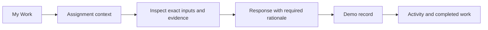

# Forge workspace — design specification

## Product promise

Know what needs you, understand the evidence, and act within your authority.

The primary persona is a human contributor or decision maker working alongside AI and deterministic workers. The prototype's Alex persona holds reviewer and release-authority roles on different assignments to demonstrate both experiences.

## Navigation and screen inventory

| Screen | Primary question | Main action |
| --- | --- | --- |
| My Work | What requires my attention? | Open an assignment |
| Assignment / Overview | What am I responsible for, with which inputs and permissions? | Submit a scoped response |
| Assignment / Evidence | What supports this work? | Inspect an artifact |
| Assignment / Activity | What was recorded and why? | Read the response history |
| Organization | Who is bound to each role? | Inspect the illustrative responsibility structure |
| Evidence | How do contribution, assessment, authority, and effect connect? | Inspect a record or open the release decision |

## First-use path

The production path must replace the demo step with a command to the Go application API, server-side identity and permission checks, governed admission, and an authoritative receipt. A pending command must not appear as an admitted decision. Approval must remain distinct from execution and confirmed external effects.

## Interaction rules

- Responsibility cards filter the inbox; selecting a card again clears the filter.
- Search combines with the selected category and To do / Completed state.
- Review assignments expose assessment, not approval actions.
- Release-authority assignments expose approval and refusal. Both require rationale.
- Cancel and Escape dismiss a dialog without changing the assignment.
- A recorded local response removes the assignment from To do and preserves it under Completed for this session.
- Recording a release decision updates the sample evidence chain's Authority step. Effect remains unestablished.
- Refresh resets all simulated responses. This is stated in the response dialog.

## Visual system

| Element | Direction |
| --- | --- |
| Canvas | Warm, pale neutral, `#f6f7f3` |
| Navigation | Deep green, `#1c302e` |
| Primary action | Forest green, `#355440` |
| Authority | Pale amber background with dark amber label |
| Assessment | Pale slate-blue background with dark blue label |
| Reconciliation | Pale lavender background with dark purple label |
| Surface | White panels, fine borders, small corner radii |
| Type | Local system sans-serif; restrained headings and compact supporting text |
| Icons | Lucide line icons; icons supplement text labels |

The desktop composition reserves the left edge for navigation, the main area for work, and a narrow right column for a highlighted decision and organization activity. Assignment detail uses the same right column for permission scope and response actions. On smaller screens it becomes a single-column reading order.

## Deliberate limits and follow-up design

This exploration covers the core human work loop. Production design still needs admission-pending and rejection states, revoked authority, changed inputs, missing or invalid evidence, concurrent decisions, interrupted sessions, and loss of connectivity. A real deployment also needs identity selection, role administration, audit search, and persistent accessible notifications. Those screens are not represented by inert navigation items here.

Do not infer completed deployment, verified provenance, or server authorization from this prototype. Organization cards and older activity entries are fixed illustrations. User-submitted demo responses are the only mutable records.
