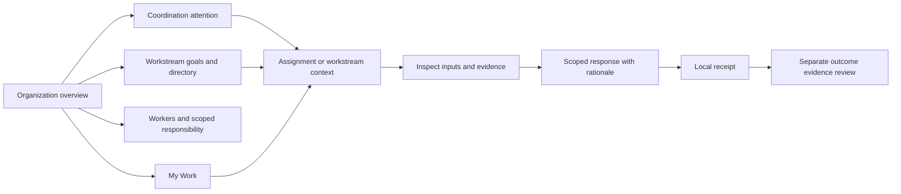

# Forge workspace — design specification

## Product promise

Understand the organization, find what needs coordination, and enter personal work with clear responsibility and evidence.

The primary persona is a human contributor or decision maker working alongside AI and deterministic workers. The prototype's Alex persona holds reviewer and release-authority roles on different assignments to demonstrate both experiences.

## Navigation and screen inventory

| Screen | Primary question | Main action |
| --- | --- | --- |
| My Work | What requires my attention? | Open an assignment |
| Assignment / Overview | What am I responsible for, with which inputs and permissions? | Submit a scoped response |
| Assignment / Evidence | What supports this work? | Inspect an artifact |
| Assignment / Activity | What was recorded and why? | Read the response history |
| Organization | What needs coordination across shared goals? | Inspect attention or open a workstream/worker |
| Workstreams directory | Which goals need responsibility or outcome evidence? | Filter and open a workstream |
| Workers directory | Who holds which scoped responsibilities? | Filter workers and inspect bindings/assignment links |
| Workstream detail | How should responsibilities exchange work? | Inspect flow, assignment, handoff or outcome |
| Organization attention/activity | What needs follow-up, and which records exist? | Inspect a signal or record |
| Demos | How does collaboration work? | Start the guided walkthrough or independent scenarios |
| Evidence | How do contribution, assessment, authority, and effect connect? | Inspect a record or open the release decision |

## First-use path

The production path must replace the demo step with a command to the Go application API, server-side identity and permission checks, governed admission, and an authoritative receipt. A pending command must not appear as an admitted decision. Approval must remain distinct from execution and confirmed external effects.

## Interaction rules

- Responsibility cards filter the inbox; selecting a card again clears the filter.
- Search combines with the selected category and To do / Completed state.
- Review assignments expose assessment, not approval actions.
- Release-authority assignments expose approval and refusal. Both require rationale.
- Cancel and Escape dismiss a dialog without changing the assignment.
- A recorded local response removes the assignment from To do and preserves it under Completed for this session.
- Recording a release decision updates the sample evidence chain's Authority step. Effect remains unestablished.
- Refresh resets all simulated responses. This is stated in the response dialog.

## Visual system

| Element | Direction |
| --- | --- |
| Canvas | Warm, pale neutral, `#f6f7f3` |
| Navigation | Deep green, `#1c302e` |
| Primary action | Forest green, `#355440` |
| Authority | Pale amber background with dark amber label |
| Assessment | Pale slate-blue background with dark blue label |
| Reconciliation | Pale lavender background with dark purple label |
| Surface | White panels, fine borders, small corner radii |
| Type | Local system sans-serif; restrained headings and compact supporting text |
| Icons | Lucide line icons; icons supplement text labels |

Organization Overview prioritizes the attention summary immediately after shared purpose. Concise workstream cards expose goals/outcomes and link to detail. Worker summaries expose identity/type and scoped binding counts; full roles/scopes and assignment lists live in their directories/details. Native disclosures retain secondary other-work/gap context and the workspace glossary. Section shortcuts remain keyboard accessible.

The desktop composition reserves the left edge for navigation and the main area for organization coordination. My Work uses a narrow right column for personal context. Assignment detail uses the same right column for permission scope and response actions. On smaller screens it becomes a single-column reading order.

## Deliberate limits and follow-up design

This exploration covers an organization-first sample workspace and the human work loop. It includes bounded response-delivery/readiness previews, local proposals and allocation-plan decisions. Accepted plans await allocation: they create no assignment, binding or permission. Organization activity lists proposal/plan-decision records alongside responses and evidence. Each dated section is independently ordered; local coordination records disappear when their proposal is removed and are not a permanent audit log.

Production design still needs validated identity and effective authority, durable admission/receipts, concurrent changes, real runtime/worker data and verified external effects. A shared frontend scenario contract now feeds the overview and directories for both samples. The larger sample has scenario-qualified read-only detail/assignment inspection; specialized interactive assignment inputs remain main-only. The original standalone larger demo also remains available. Role administration, broader audit search and organization/persona switching need explicit data and interaction contracts.

Do not infer completed deployment, verified provenance or server authorization from this prototype. Responses, proposals and plan decisions are mutable session records; refresh clears them. Main organization relationships and evidence fixtures are authored examples. The current prototype demonstrates Software Factory; general virtual organization fit needs a second domain using the same screens.
